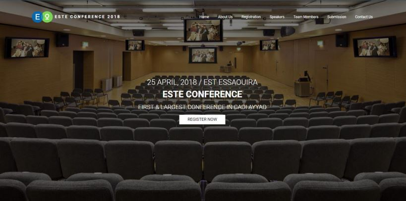

# Conference Management Website

The project is a website for our school that use to manage the conference that my school organize, the project is inspired by [easychair](https://easychair.org/) platform. The project developed using PHP MVC architecture.

### Project structure

*  The ``model`` folder contains the models.

*  The ``controller`` folder contains the controllers.

*  The ``view`` folder contains the views.

*  The ``source`` folder contains the public files.

*  The ``table/pfe.sql`` file contains the database structer.

*  The ``document`` folder contains the documents related to the project such as presentation and report writing in the French language.

### Running the project

- Install the PHP server ``laragon`` or ``Xampp`` or ``wamp``.

- Copy the project folder to ``www`` folder inside the PHP server.

- Create a database in PHP my admin and name it ``pfe`` and run the ``table/pfe.sql`` script.

- Go to the browser and tape ``localhost:/gestion-du-conference/view/_index.php``.

- For more information about tools, architecture and conception check the ``document/rapport_de_PFE.pdf`` file. Note that the report write in french for academic reason. 

- If you have any issues feel free to ask us.

### Demo

[]

## Authors
* [Abdelkarim ESSOUBAKI](https://www.linkedin.com/in/essoubaki-abdelkarim-299310142/)
* [El Houcine ES SANHAJI](https://github.com/essanhaji)

 

## Thank you.
